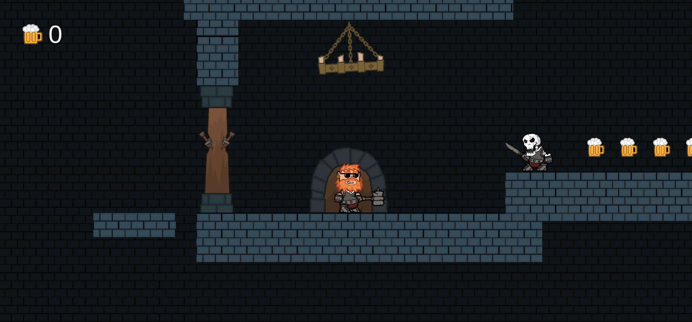
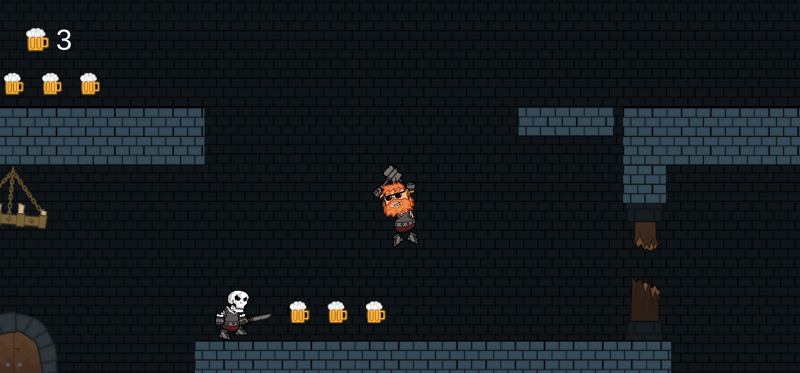
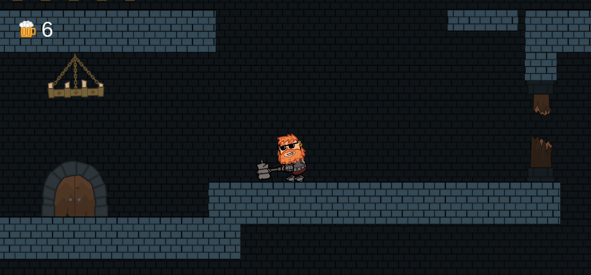

# 2DPlatformer

Third Unity Project

This game is a 2D platformer game where the player is playing as a Dwarf.

The player can pick up ale which serves as score, and use his axe to progress in the level.

Attacking multiple times the enemy with his axe will allow the Dwarf to defeat the skeletons present in the level.

